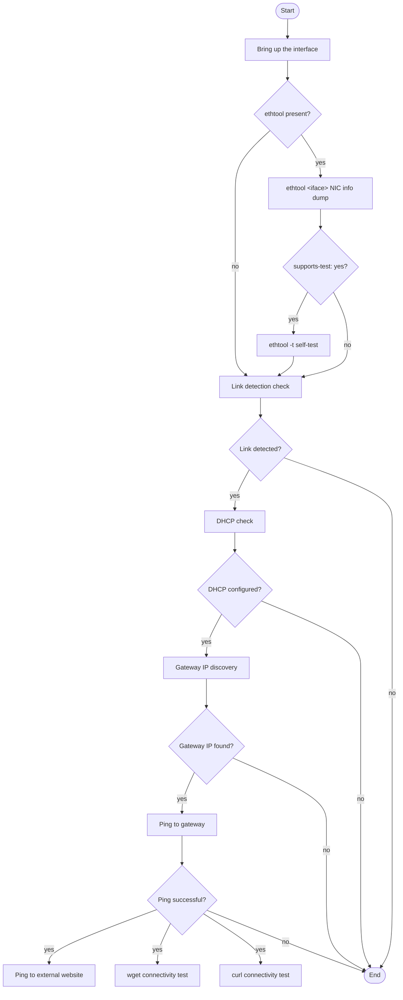

# Ethernet Interface Diagnostics and Connectivity Validation Script

## Overview

This script automates testing and diagnostics of Ethernet interfaces on Linux-based systems. It evaluates the status, configuration, and connectivity of each interface using standard tools such as `ip`, `ethtool`, `ping`, `wget`, and `curl`.

When executed with a **SystemReady DT image**, the script runs automatically as part of the ACS (Architecture Compliance Suite) test framework with all dependencies. Output logs are generated at `linux_tools/ethtool-test.log` within the `acs_results` directory.

---

## Requirements

- Python 3.x
- Linux tools:
  - `ip`
  - `ethtool`
  - `ping`
  - `wget`
  - `curl`
  - `udhcpc` or `dhclient`
    
### For standalone use on other systems:

1. Install the tools if missing:
```bash
sudo apt install iproute2 ethtool wget curl python3
```

2. Make the script executable (if needed):

```bash
chmod +x ethtool-test.py
```

3. Run the script as root:

```bash
sudo ./ethtool-test.py
```

Root privileges are required to manipulate interface state and run diagnostics.

---

## Execution Flow

The script performs diagnostics in a staged manner for each detected Ethernet interface, ensuring that tests only proceed when earlier conditions are met. The flow is designed to be conditional and isolated per interface.

1. **Interface detection**  
   The script uses `ip -o link` to list all network interfaces and selects only those marked as Ethernet (`ether` in the output). These are added to a test list.

2. **Pre-test setup**  
   All **physical** Ethernet interfaces are brought down using `ip link set` (virtual interfaces are detected and skipped).
   
3. **Interface-by-Interface testing**  
   Interfaces are brought up and tested one at a time. The previous interface is brought down before the next is activated, maintaining test isolation.

4. **NIC information logging**  
   `ethtool <interface>` is executed to display the NIC's capabilities, including supported speeds, duplex modes, and link detection.

5. **Self-Test execution**  
   If the interface driver supports it (`supports-test: yes` from `ethtool -i`), the script runs `ethtool -t` to perform a self-test. Results are logged for review.

6. **Link status verification**  
   The script checks for `Link detected: yes` in the `ethtool` output. If ethtool is not present, the script falls back to sysfs for link status. The interface is skipped from further testing if the link is not detected.

7. **DHCP address check**  
   Using `ip address show`, the script verifies that a dynamic (DHCP-assigned) IPv4 address is present. If not, it skips gateway and external connectivity checks.

8. **Gateway IP discovery and ping**  
   The script extracts the default gateway from `ip route` and attempts to ping it. If the gateway cannot be reached, external connectivity tests are skipped.

9. **External connectivity tests**  
   If the gateway ping is successful, the script pings `www.arm.com` to confirm DNS resolution and routing. `wget` and `curl` are used to verify HTTPS connectivity to `https://www.arm.com`.

10. **Iteration and completion**  
   After testing an interface, it is brought down, and the script proceeds to the next one. Once all interfaces are tested, the script exits by printing a detailed summary and restoring the original state of all interfaces.

---

## Test Execution Flow

Before processing each Ethernet interface through the flowchart, the script:

1. Detects all Ethernet interfaces using the `ip` command.
2. Bring down all physical interfaces to ensure a controlled and isolated testing environment (virtual interfaces are detected and skipped)
   
Then, for each interface, it proceeds through the validation and connectivity checks shown below.



---

## Script Exit and Skip Conditions

The script may exit early or skip processing specific interfaces under certain conditions. Below are the key log messages indicating such exits or skips:

### Script exit conditions

The following messages indicate that the entire script will terminate:

- `WARN: No ethernet interfaces detected via ip linux command, Exiting ...`
- `Error occurred: <exception message>`

### Per-Interface skip (script continues with next interface)

These messages indicate that the current interface failed validation and is being skipped:

- `WARN: Unable to bring up ethernet interface <iface> using ip`
- `WARN: Link not detected for <iface>`
- `WARN: Link not detected for <iface> (carrier=<value>, operstate=<value>)`
- `INFO: No IPv6 address found on <iface>, skipping IPv6 test`
- `WARN: Failed to ping router/gateway[<gateway_ip>] for <iface>`
- `WARN: Failed to ping www.arm.com via <iface>`
- `WARN: No default route available for <iface> (route get failed), skipping further tests for this interface`
- `WARN: Unable to parse gateway/dev from route output, skipping further tests for <iface>`
- `WARN: Default route to 8.8.8.8 is via <other_iface>, not <iface>; skipping further tests for <iface>`

--------------
*Copyright (c) 2025, Arm Limited and Contributors. All rights reserved.*
