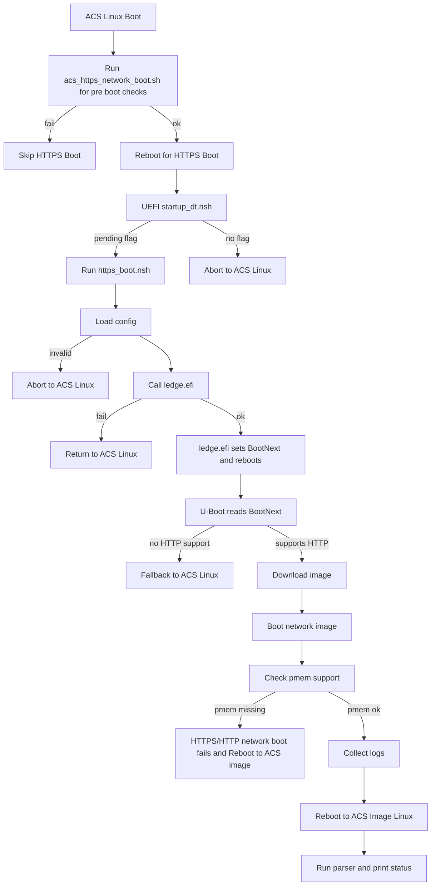

# Network Boot Support in SystemReady-DT

This is an overview of **HTTPS Boot** support implemented within the **SystemReady-DT ACS image**.

---

## Overview

This repository extends the **Arm SystemReady Devicetree** Yocto build with
support for **HTTPS/HTTP Network Boot** using a custom UEFI application
(`ledge.efi`) and an automated two-stage boot flow:

1. **Linux Pre-Boot Validation**
2. **UEFI HTTPS Boot Execution**

The integration includes:

- Automatic validation script (`acs_https_network_boot.sh`)
- HTTPS Boot UEFI script (`https_boot.nsh`)
- Network Boot Parser (`acs_network_boot_parser.sh`)
- Structured PASS/FAIL logging
- Updated flag-handling logic in `startup_dt.nsh`
- Yocto recipe support for building & bundling `ledge.efi`

---

## Requirements
 - System must have a **valid ESP partition**
 - U-Boot must have:
   - HTTP support
   - pmem support in the kernel DeviceTree
 - Network boot image kernel must include `pmem` drivers, the provided pre-built acs-network-boot-image image already consists of the requirement
 - Network boot image must include:
   - `lsblk`, `blkid`, `dmesg`
   - Ability to write logs back to `acs_results_template`

---

## Directory Structure
```
Script files path - FSx:\
 ├── acs_tests\
      ├── app\
      │    ├── ledge.efi
      │    ├── https_boot.nsh
      ├── config\
      │    └── system_config.txt
      └── acs_results_template\
           └── acs_results\
                └── network_boot\
                     ├── https_network_boot_console.log
                     ├── network_boot_results.log
                     ├── lsblk.txt
                     ├── blkid.txt
                     └── dmesg.txt

```
---

## HTTPS Boot Flow

1. ACS Linux boots and `init.sh` runs `acs_https_network_boot.sh`, which checks the ESP, validates the HTTPS/HTTP URL from `system_config.txt`, verifies reachability with `wget`, prepares the HTTPS boot configuration, and reboots if everything is valid.

2. After reboot, UEFI automatically starts `https_boot.nsh` based on the flag check, which reads `acs_https.conf.nsh`, logs the configuration details, and invokes `ledge.efi` with the parsed URL.

3. `ledge.efi` programs a new UEFI boot option (`Boot####`) that points to the given HTTP(S) URL, sets `BootNext` to that entry, and triggers a reboot.

4. On the next boot, the U-Boot processes `BootNext`, performs the HTTP(S) download of the remote image, and boots into the ACS HTTPS Boot image provided by that URL.

5. The network boot image runs its init script, collects Linux logs (`lsblk.txt`, `blkid.txt`, `dmesg.txt`), writes them to the ACS results directory, and reboots back into the main ACS SystemReady-DT image.

6. On the subsequent ACS Linux boot, `init.sh` detects that a network boot sequence ran and calls `acs_network_boot_parser.sh`, which checks that the logs are present, writes `Network_Boot_Result: PASSED/FAILED`, skips ACS tests, and exits to the Linux prompt.


---

## ACS Network Boot Image

You can use the ACS image provided for HTTPS/HTTP network-boot testing by uncommenting `HTTPS_BOOT_IMAGE_URL` in [`system_config.txt`](../common/config/system_config.txt).

**Network Boot Image:** [`acs-network-boot-image.img`](../SystemReady-devicetree-band/prebuilt_images/network_boot_image/acs-network-boot-image.img)

To host the pre-built image locally:

- Download the image through github or using wget:
  `wget https://raw.githubusercontent.com/ARM-software/arm-systemready/main/SystemReady-devicetree-band/prebuilt_images/network_boot_image/acs-network-boot-image.img`

- Host the image on a local HTTP server (example):  
  `python3 -m http.server 8000`
   *(You may replace 8000 with any unused port)*

- Access the image using:  
  `http://<local-host-ip>:8000/<acs-network-boot-image.img>`

Add this URL to `HTTPS_BOOT_IMAGE_URL` in `system_config.txt`.

---
## Limitations
- Failures in U-Boot are not logged and must be debugged from the U-Boot console.
- The .wic format images cannot be used (supports .iso and .img)
- URL to network boot image should be a direct link; redirects are not allowed.

--------------
*Copyright (c) 2025, Arm Limited and Contributors. All rights reserved.*
