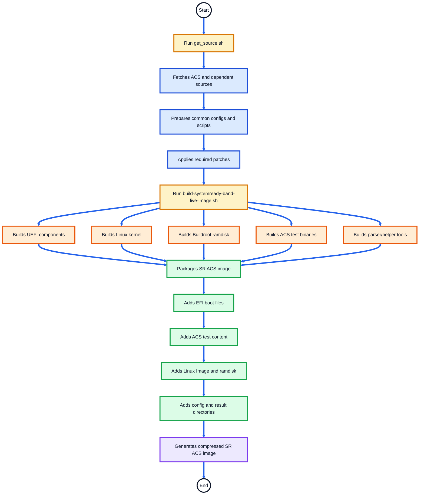
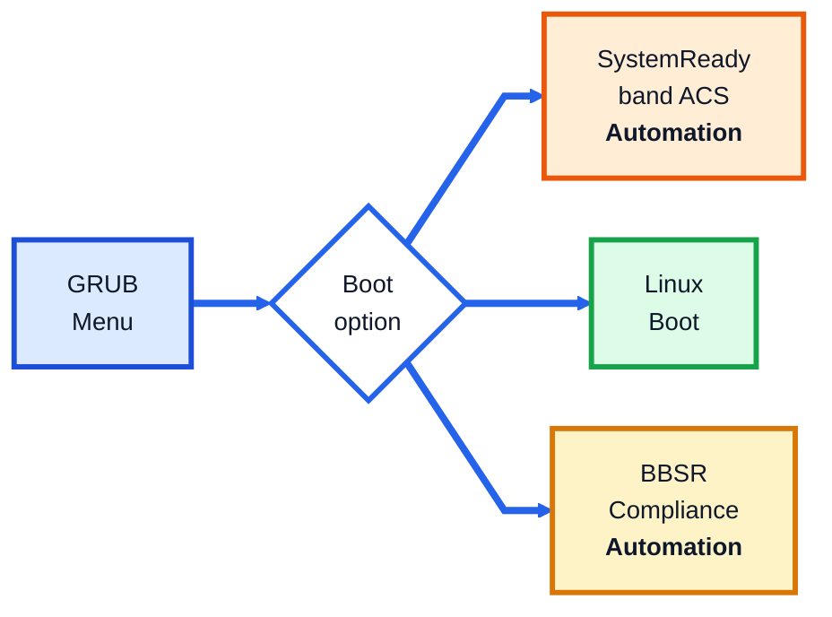
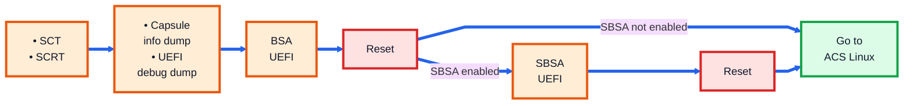
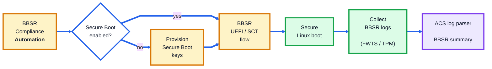

# SystemReady Band ACS Automation Flow

## Overview

This document explains the automation flow of the **Arm SystemReady Band ACS** image.

The SystemReady Band ACS image is a bootable validation environment used to run firmware, UEFI, Linux, architecture, and compliance test suites on Arm SystemReady platforms.

The automation flow covers:

- Image validations
- SystemReady Band ACS Automation Flow
- GRUB Boot Menu Options
- Configuration Files
- Result Collection

---

## What the SR Image Validates

| Validation Area | Tools / Test Suites |
|---|---|
| Firmware compliance | SCT, SCRT, FWTS |
| Base system architecture | BSA |
| Server architecture | SBSA |
| Secure Boot compliance | BBSR |
| Manageability checks | SBMR |
| Linux-side validation | Linux scripts and test tools |
| Result reporting | ACS log parser and waiver flow |

---

## SystemReady Band ACS Automation Flow

This section explains the end-to-end automation flow for the SystemReady Band ACS image.

The flow is divided into two parts:

1. **Build Automation Flow** — how the ACS image is prepared and generated.
2. **Run Automation Flow** — what happens when the ACS image boots on the platform.

---
### SR Build Automation Flow

Commands executed from **arm-systemready/SystemReady-band/**:

```text
./build-scripts/get_source.sh
./build-scripts/build-systemready-band-live-image.sh
```


---
## SR Runtime Flowcharts
- These diagrams show the high-level runtime automation flow.
- **Reboot handling:** Some test suites intentionally reset the platform after saving results. After reset, the platform returns to **GRUB** and resumes from the next pending stage. Completed suites are skipped using result logs or state.
---
### 1. Runtime Entry Flow

> By default, **SystemReady band ACS (Automation)** is selected and the full automation flow is executed.  
> Click a boot option box to jump to the corresponding flow section in GitHub.



---

### 2. SystemReady band ACS Automation Flow

> This flow is executed when **SystemReady band ACS (Automation)** is selected from GRUB.

##### UEFI ACS Flow



<div align="center">

**➡️ Continues with ACS Linux flow**

</div>

##### Linux ACS Flow

```mermaid
%%{init: {
  "theme": "base",
  "flowchart": {
    "curve": "linear",
    "nodeSpacing": 30,
    "rankSpacing": 40
  },
  "themeVariables": {
    "fontFamily": "Arial",
    "fontSize": "14px",
    "primaryBorderColor": "#0f172a",
    "lineColor": "#2563eb",
    "tertiaryColor": "#ffffff"
  }
}}%%

flowchart LR

    linkStyle default stroke:#2563eb,stroke-width:4px;

    A["ACS<br/>Linux"]
    A --> B["• Linux<br/>  debug dump<br/>• Device driver<br/>  info"]
    B --> C["FWTS"]

    C --> D["BSA<br/>Linux"]

    C -->|"SBMR enabled"| E["SBMR<br/>in-band"]
    E --> D

    D --> F["• EDK2<br/>  test parser<br/>• Post<br/>  scripts"]

    D -->|"SBSA enabled"| G["SBSA<br/>Linux"]
    G --> F

    F --> H["ACS log parser<br/><br/>(apply waivers<br/>if configured)"]
    H --> I["Print<br/>ACS summary"]

    classDef entry fill:#dbeafe,stroke:#1d4ed8,stroke-width:3px,color:#0f172a;
    classDef linux fill:#dcfce7,stroke:#16a34a,stroke-width:3px,color:#0f172a;
    classDef result fill:#ede9fe,stroke:#7c3aed,stroke-width:3px,color:#0f172a;

    class A entry;
    class B,C,D,E,G linux;
    class F,H,I result;
```



---

### 3. Linux Automation Flow

> This flow is executed either after **SystemReady band ACS (Automation)** completes the UEFI phase, or directly when **Linux Boot** is selected from GRUB.

```mermaid
%%{init: {
  "theme": "base",
  "flowchart": {
    "curve": "linear",
    "nodeSpacing": 30,
    "rankSpacing": 40
  },
  "themeVariables": {
    "fontFamily": "Arial",
    "fontSize": "14px",
    "primaryBorderColor": "#0f172a",
    "lineColor": "#2563eb",
    "tertiaryColor": "#ffffff"
  }
}}%%

flowchart LR

    linkStyle default stroke:#2563eb,stroke-width:4px;

    A["ACS Linux<br/>Initialization"]
    A --> B["• Linux<br/>  debug dump<br/>• Device driver<br/>  info"]
    B --> C["FWTS"]

    C --> D["BSA<br/>Linux"]

    C -->|"SBMR enabled"| E["SBMR<br/>in-band"]
    E --> D

    D --> F["• EDK2<br/>  test parser<br/>• Post<br/>  scripts"]

    D -->|"SBSA enabled"| G["SBSA<br/>Linux"]
    G --> F

    F --> H["ACS log parser<br/><br/>(apply waivers<br/>if configured)"]
    H --> I["Print<br/>ACS summary"]

    classDef entry fill:#dbeafe,stroke:#1d4ed8,stroke-width:3px,color:#0f172a;
    classDef linux fill:#dcfce7,stroke:#16a34a,stroke-width:3px,color:#0f172a;
    classDef result fill:#ede9fe,stroke:#7c3aed,stroke-width:3px,color:#0f172a;

    class A entry;
    class B,C,D,E,G linux;
    class F,H,I result;
```



---

### 4. BBSR Automation Flow

> If Secure Boot keys are not provisioned automatically, provision the keys manually and then run the BBSR automation again.


---
## GRUB Boot Menu Options

| Boot Option | Purpose |
|---|---|
| `Linux Boot` | Boots ACS Linux environment |
| `SystemReady band ACS (Automation)` | Runs the complete automated SR compliance flow |
| `BBSR Compliance (Automation)` | Runs Secure Boot / BBSR compliance flow |
| `UEFI Execution Environment` | Provides manual UEFI shell execution environment |
| `Linux Execution Environment` | Provides manual Linux-side execution environment |
| `Linux Boot with SetVirtualAddressMap enabled` | Debug or special Linux boot option |
---

## Configuration Files

| File | Description |
|---|---|
|[`acs_config.txt`](../common/config/acs_config.txt) | Contains ACS and specification version information |
|[`acs_run_config.init`](../common/config/acs_run_config.ini)  | Enables or disables test suites and passes test arguments |
|[`system_config.txt`](../common/config/system_config.txt)  | Contains platform details used in the final ACS report |

---
## Result Collection

ACS logs and summaries are stored under:
```text
acs_results_template/acs_results/
```

Final parsed reports are generated under:
```text
acs_results_template/acs_results/acs_summary/
```
--------------
*Copyright (c) 2026, Arm Limited and Contributors. All rights reserved.*
