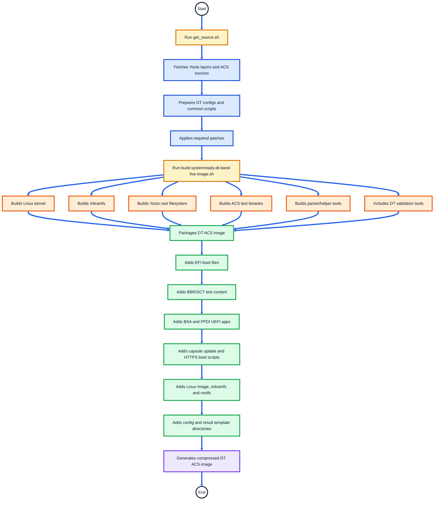
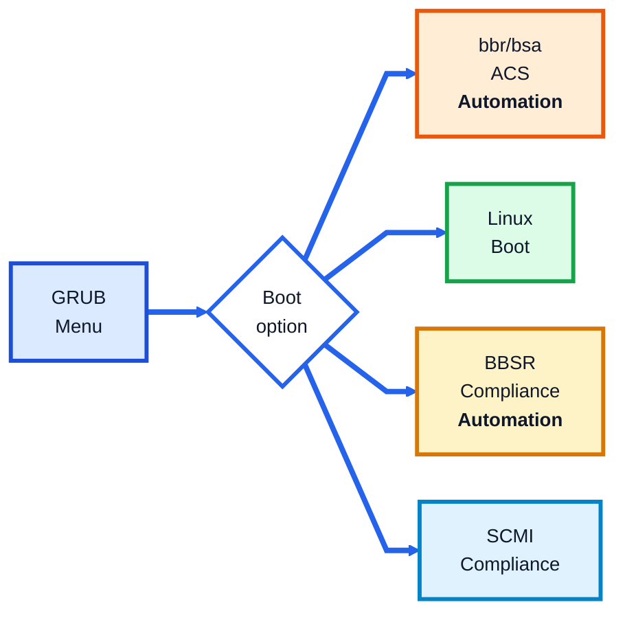
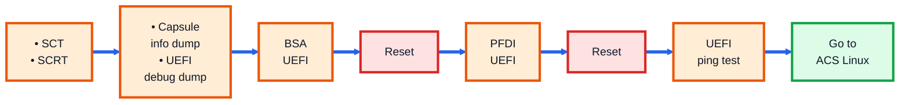
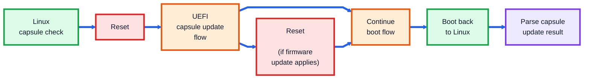
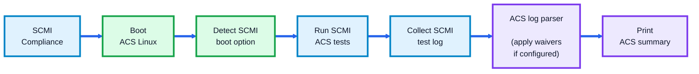

# SystemReady Devicetree Band ACS Automation Flow

## Overview

This document explains the automation flow of the **Arm SystemReady Devicetree Band ACS** image.

The SystemReady Devicetree Band ACS image is a bootable validation environment used to run firmware, UEFI, Linux, Devicetree, architecture, network, capsule update, and compliance test suites on Arm SystemReady Devicetree platforms.

The automation flow covers:

- Image validations
- SystemReady Devicetree Band ACS Automation Flow
- GRUB Boot Menu Options
- Configuration Files
- Result Collection

---

## What the DT Image Validates

| Validation Area | Tools / Test Suites |
|---|---|
| Firmware compliance | SCT, FWTS |
| Base system architecture | BSA |
| Platform firmware/device interface | PFDI |
| Secure Boot compliance | BBSR |
| System control and management | SCMI |
| Devicetree validation | DT validation tools, DT parser, DT kernel selftests |
| Linux device visibility | Device driver information script |
| Network validation | UEFI ping test, HTTPS/network boot, Ethernet checks |
| Block device validation | Block device read/write checks |
| Capsule update | Capsule update scripts and UEFI apps |
| Result reporting | EDK2 test parser, ACS log parser, waiver flow |

---

## SystemReady Devicetree Band ACS Automation Flow

This section explains the end-to-end automation flow for the SystemReady Devicetree Band ACS image.

The flow is divided into two parts:

1. **Build Automation Flow** — how the DT ACS image is prepared and generated.
2. **Run Automation Flow** — what happens when the DT ACS image boots on the platform.

---
### DT Build Automation Flow

Commands executed from **arm-systemready/SystemReady-devicetree-band/Yocto/**:

```text
./build-scripts/get_source.sh
./build-scripts/build-systemready-dt-band-live-image.sh
```


---
## DT Runtime Flowcharts
- These diagrams show the high-level runtime automation flow for the **SystemReady Devicetree Band ACS** image. 
- Some flows reset the platform after saving state or results. After reset, the platform returns to **GRUB** and resumes the next pending step using logs/state files.

---
### 1. Runtime Entry Flow
> By default, **bbr/bsa ACS (Automation)** is selected and the full DT automation flow is executed.  
> Click a boot option box to jump to the corresponding flow section in GitHub.


---

### 2. bbr/bsa ACS Automation Flow

> This flow is executed when **bbr/bsa ACS (Automation)** is selected from GRUB.
##### UEFI ACS Flow



<div align="center">

**➡️ Continues with ACS Linux flow**

</div>

##### Linux ACS Flow

```mermaid
%%{init: {
  "theme": "base",
  "flowchart": {
    "curve": "linear",
    "nodeSpacing": 30,
    "rankSpacing": 40
  },
  "themeVariables": {
    "fontFamily": "Arial",
    "fontSize": "14px",
    "primaryBorderColor": "#0f172a",
    "lineColor": "#2563eb",
    "tertiaryColor": "#ffffff"
  }
}}%%

flowchart LR

    linkStyle default stroke:#2563eb,stroke-width:4px;

    A["ACS<br/>Linux"]

    A --> B["• Linux<br/>  debug dump<br/>• Device driver<br/>  info"]
    B --> C["FWTS"]
    C --> D["BSA<br/>Linux"]

    D --> E["• Devicetree<br/>  validation<br/>• PSCI<br/>  collection"]

    E --> F["• DT kernel<br/>  selftest<br/>• Runtime<br/>  mapping check"]

    F --> G["• Ethernet /<br/>  network test<br/>• Block device<br/>  check"]

    G --> H["Network boot<br/>flow<br/><br/>(if configured)"]
    H --> I["Capsule<br/>update flow"]

    I --> J["ACS log parser<br/><br/>(apply waivers<br/>if configured)"]
    J --> K["Print<br/>ACS summary"]

    click H "https://github.com/ARM-software/arm-systemready/blob/main/docs/systemready_devicetree_band_flow.md#network-boot" "Go to Network Boot Flow"
    click I "https://github.com/ARM-software/arm-systemready/blob/main/docs/systemready_devicetree_band_flow.md#capsule-update-flow" "Go to Capsule Update Flow"

    classDef entry fill:#dbeafe,stroke:#1d4ed8,stroke-width:3px,color:#0f172a;
    classDef linux fill:#dcfce7,stroke:#16a34a,stroke-width:3px,color:#0f172a;
    classDef optional fill:#fef3c7,stroke:#d97706,stroke-width:3px,color:#0f172a;
    classDef result fill:#ede9fe,stroke:#7c3aed,stroke-width:3px,color:#0f172a;

    class A entry;
    class B,C,D,E,F,G,I linux;
    class H optional;
    class J,K result;
```



#### Capsule Update Flow

> Linux starts capsule update validation and resets into UEFI. UEFI runs the capsule update flow.  
> If a capsule is applied, the platform may reset again as part of firmware update handling. Linux parses the result on the next boot.



#### Network Boot

> This flow runs only when **HTTPS_BOOT_IMAGE_URL** is configured in [`system_config_dt.txt`](../common/config/system_config_dt.txt).

```mermaid
%%{init: {
  "theme": "base",
  "flowchart": {
    "curve": "linear",
    "nodeSpacing": 25,
    "rankSpacing": 35
  },
  "themeVariables": {
    "fontFamily": "Arial",
    "fontSize": "14px",
    "primaryBorderColor": "#0f172a",
    "lineColor": "#2563eb",
    "tertiaryColor": "#ffffff"
  }
}}%%

flowchart LR

    linkStyle default stroke:#2563eb,stroke-width:4px;

    A["Linux<br/>pre-boot<br/>checks"]
    A --> R1["Reset"]

    R1 --> B["UEFI<br/>network boot<br/>flow"]
    B --> R2["Reset"]

    R2 --> C["U-Boot<br/>HTTP/HTTPS<br/>BootNext"]

    subgraph MIN["ACS Minimal Image"]
        direction LR
        D["Boot minimal<br/>network image"]
        D --> E["Collect<br/>network boot<br/>logs"]
        E --> R3["Reset"]
    end

    C --> D
    R3 --> F["Boot back<br/>to ACS Linux"]
    F --> G["Parse network<br/>boot result"]

    classDef optional fill:#fef3c7,stroke:#d97706,stroke-width:3px,color:#0f172a;
    classDef uefi fill:#ffedd5,stroke:#ea580c,stroke-width:3px,color:#0f172a;
    classDef reboot fill:#fee2e2,stroke:#dc2626,stroke-width:3px,color:#0f172a;
    classDef linux fill:#dcfce7,stroke:#16a34a,stroke-width:3px,color:#0f172a;
    classDef result fill:#ede9fe,stroke:#7c3aed,stroke-width:3px,color:#0f172a;

    class A,C,D,E optional;
    class B uefi;
    class R1,R2,R3 reboot;
    class F linux;
    class G result;

    style MIN fill:#fff7ed,stroke:#d97706,stroke-width:3px,color:#0f172a;
```


---
### 3. Linux Automation Flow

> This flow is executed either after **bbr/bsa ACS (Automation)** completes the UEFI phase, or directly when **Linux Boot** is selected from GRUB.

```mermaid
%%{init: {
  "theme": "base",
  "flowchart": {
    "curve": "linear",
    "nodeSpacing": 30,
    "rankSpacing": 40
  },
  "themeVariables": {
    "fontFamily": "Arial",
    "fontSize": "14px",
    "primaryBorderColor": "#0f172a",
    "lineColor": "#2563eb",
    "tertiaryColor": "#ffffff"
  }
}}%%

flowchart LR

    linkStyle default stroke:#2563eb,stroke-width:4px;

    A["ACS Linux<br/>initialization"]

    A --> B["• Linux<br/>  debug dump<br/>• Device driver<br/>  info"]
    B --> C["FWTS"]
    C --> D["BSA<br/>Linux"]

    D --> E["• Devicetree<br/>  validation<br/>• PSCI<br/>  collection"]

    E --> F["• DT kernel<br/>  selftest<br/>• Runtime<br/>  mapping check"]

    F --> G["• Ethernet /<br/>  network test<br/>• Block device<br/>  check"]

    G --> H["Network boot<br/>flow<br/><br/>(if configured)"]
    H --> I["Capsule<br/>update flow"]

    I --> J["ACS log parser<br/><br/>(apply waivers<br/>if configured)"]
    J --> K["Print<br/>ACS summary"]

    click H "https://github.com/ARM-software/arm-systemready/blob/main/docs/systemready_devicetree_band_flow.md#network-boot" "Go to Network Boot Flow"
    click I "https://github.com/ARM-software/arm-systemready/blob/main/docs/systemready_devicetree_band_flow.md#capsule-update-flow" "Go to Capsule Update Flow"

    classDef entry fill:#dbeafe,stroke:#1d4ed8,stroke-width:3px,color:#0f172a;
    classDef linux fill:#dcfce7,stroke:#16a34a,stroke-width:3px,color:#0f172a;
    classDef optional fill:#fef3c7,stroke:#d97706,stroke-width:3px,color:#0f172a;
    classDef result fill:#ede9fe,stroke:#7c3aed,stroke-width:3px,color:#0f172a;

    class A entry;
    class B,C,D,E,F,G,I linux;
    class H optional;
    class J,K result;
```


---
### 4. BBSR Automation Flow

> - This flow is executed when **BBSR Compliance (Automation)** is selected from GRUB.  
> - Secure Boot key provisioning is attempted automatically. If automatic provisioning does not complete, provision the keys manually and run the BBSR automation again.  
> - In DT band, after BBSR logs and summary are generated, Secure Boot is cleared before returning to the Linux prompt.

```mermaid
%%{init: {
  "theme": "base",
  "flowchart": {
    "curve": "linear",
    "nodeSpacing": 25,
    "rankSpacing": 35
  },
  "themeVariables": {
    "fontFamily": "Arial",
    "fontSize": "14px",
    "primaryBorderColor": "#0f172a",
    "lineColor": "#2563eb",
    "tertiaryColor": "#ffffff"
  }
}}%%

flowchart LR

    linkStyle default stroke:#2563eb,stroke-width:4px;

    A["BBSR<br/>Compliance<br/><b>Automation</b>"]
    A --> B{"Secure Boot<br/>enabled?"}

    B -->|"yes"| D["BBSR<br/>UEFI / SCT<br/>flow"]
    B -->|"no"| C["Provision<br/>Secure Boot<br/>keys"]

    C --> D

    D --> E["Secure<br/>Linux boot"]
    E --> F["Collect<br/>BBSR logs<br/><br/>(FWTS / TPM)"]
    F --> G["ACS log parser<br/><br/>BBSR summary"]

    G --> H{"Secure Boot<br/>still enabled?"}

    H -->|"yes"| R1["Reset"]
    R1 --> I["UEFI clears<br/>PK"]
    I --> R2["Reset"]
    R2 --> J["Boot Linux<br/>terminal / prompt"]

    H -->|"no"| J

    classDef bbsr fill:#fef3c7,stroke:#d97706,stroke-width:3px,color:#0f172a;
    classDef decision fill:#ffffff,stroke:#2563eb,stroke-width:3px,color:#0f172a;
    classDef linux fill:#dcfce7,stroke:#16a34a,stroke-width:3px,color:#0f172a;
    classDef reboot fill:#fee2e2,stroke:#dc2626,stroke-width:3px,color:#0f172a;
    classDef uefi fill:#ffedd5,stroke:#ea580c,stroke-width:3px,color:#0f172a;
    classDef result fill:#ede9fe,stroke:#7c3aed,stroke-width:3px,color:#0f172a;

    class A,C,D bbsr;
    class B,H decision;
    class E,F,J linux;
    class G result;
    class R1,R2 reboot;
    class I uefi;
```


---
### 5. SCMI Compliance Flow

> This flow is executed when **SCMI Compliance** is selected from GRUB.


---

## GRUB Boot Menu Options

| Boot Option | Purpose |
|---|---|
| `Linux Boot` | Boots Yocto Linux environment |
| `bbr/bsa` | Runs the main automated DT compliance flow |
| `BBSR Compliance (Automation)` | Runs Secure Boot / BBSR compliance flow |
| `SCMI Compliance` | Boots ACS Linux with SCMI mode and runs SCMI compliance tests |

---

## Configuration Files

| File | Description |
|---|---|
|[`acs_config.txt`](../common/config/acs_config.txt) | Contains ACS and specification version information |
|[`system_config.txt`](../common/config/system_config.txt) | Contains platform details used in the final ACS report |
|[`acs_config_dt.txt`](../common/config/acs_config_dt.txt) | DT-specific ACS configuration template |
|[`system_config_dt.txt`](../common/config/system_config_dt.txt)| DT-specific system configuration template |

Important DT-related configuration fields:

| Field | Description |
|---|---|
| `Total_number_of_network_controllers` | Number of network controllers expected for validation |
| `HTTPS_BOOT_IMAGE_URL` | URL used for HTTPS/network boot validation |

---

## Result Collection

DT ACS logs and summaries are stored under:
```text
acs_results_template/acs_results/
```

Final parsed reports are generated under:
```text
acs_results_template/acs_results/acs_summary/
```
--------------
*Copyright (c) 2026, Arm Limited and Contributors. All rights reserved.*

