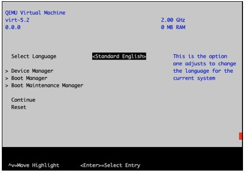
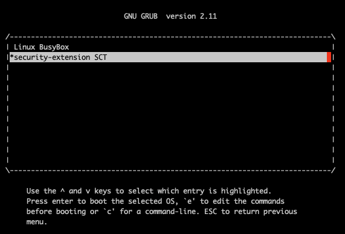
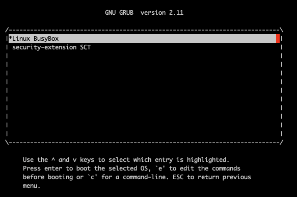
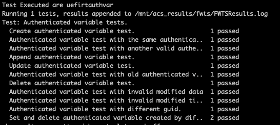

# SystemReady Security Extension User's Guide

## Introduction to the SystemReady Security Extension

The Base Boot Security Requirements (BBSR) ACS is a compliance suite that tests for compliance with the requirements specified in the Base Boot Security Requirements 1.1 specification (https://developer.arm.com/documentation/den0107/latest/).  Passing the tests in this compliance suite is required for being granted the SystemReady Security Extension certification.

The BBSR specifies requirements for the following security interfaces:
 - UEFI authenticated variables
 - UEFI secure boot
 - UEFI capsule updates
 - TPM 2.0 and measured boot

The BBSR ACS is built on the SystemReady ACS (https://github.com/ARM-software/arm-systemready), and thus follows the same model for building and running test cases.

The BBSR ACS consists of automated and manual tests.  Automated testcases include firmware based tests using the SCT (edk2-test) framework and OS-based tests using FWTS.

## Running the Security Extension ACS

### 1. Pre-requisites

The following are pre-requisites needed prior to running the ACS:

1. The ACS image must be available on the system on a bootable storage device.

2. For Secure Boot the system firmware must be in "Setup Mode" where the Secure Boot keys are cleared prior to starting the ACS.  The mechanism to enroll Secure Boot keys is platform specific and the procedure to do this must be available.

3. For the update capsule test, if the system supports in-band system firmware updates from the OS, an update capsule must be available on a storage device on the system.

### 2. Enroll the Secure Boot Keys

The ACS provides a set of keys for the UEFI Secure Boot keys PK, KEK, db, ad dbx.  Before starting the test suite these test keys must be enrolled using whatever procedure is applicable for the platform under test.

The test keys are available on the "boot" partition of the ACS image at the following path: 
`EFI\BOOT\bbr\security-extension-acs-keys.`

#### <ul>Example</ul>

For example, to enroll the Secure Boot keys on QEMU with EDK2 based firmware perform the following steps:

 - After starting the system press ESC to enter the EDK2 menu

     - 

 - Select  Device Manager -> Secure Boot Configuration

 - For Secure Boot Mode select "Custom Mode"

 - Select "Custom Secure Boot Options"

 - To enroll PK:
     - Select "PK Options"
     - Select Enroll PK -> Enroll PK Using File
     - Select the ACS disk which has the "BOOT" label
     - The secure boot keys are located at the following path on the disk:
         - EFI -> BOOT -> bbr -> security-extension-acs-keys
     - Select the following file for PK: `TestPK1.der`
     - Repeat the above steps to enroll the keys (TestKEK1.der, TestDB1.der, TestDBX1.der)  for KEK, db, dbx selecting the following options:
         - KEK Options
         - DB Options
         - DBX Option

  - After completing the above steps secure boot will be enabled

      - 

  - Reset the system

### 3. Run SCT

The Security Extension SCT is a subset of the SCT focused on security interfaces-- authenticated variables, Secure Boot variables, Secure Boot image loading, secure firmware update using update capsules, and TCG2 protocol test for systems with TPMs.

After resetting the system with the ACS Secure Boot keys enrolled grub will automatically start the Security Option SCT

 - 

After the tests complete, the system returns to the UEFI Shell and the following test output is available in the acs_results partition of the ACS disk:
 - \acs_results\sct_results\Overall\Summary.log

Expected Result: All tests pass.

Reset the system at the UEFI Shell using the **reset** command:
`FS1:\acs_results\app_output\> reset`

### 4. Run FWTS

After the system is reset when the boot process reaches the Grub menu, select the "Linux BusyBox" option to boot Linux

 - 

Linux will boot and automatically run a subset of FWTS:

 - 

Expected Result: All tests pass.

### 5. Secure firmware update test

The BBSR requires support for update capsules compliant with the UEFI specification for systems that perform in-band (e.g. OS-initiated) firmware updates.  The Security Extension ACS firmware update test is a manual test run from the UEFI Shell that requires a valid update capsule for the system's firmware.

The steps utilize the CapsuleApp.efi program that is located on the ACS image at the following path: EFI\BOOT\app\CapsuleApp.efi

 - #### A. Preparation
     - Copy the vendor provided update capsule image onto a storage device
     - Create an update capsule that has been tampered with. Using the xxd command, modify the last byte of a **copy** of the vendor provided update capsule image.
     - Copy the tampered-with update capsule onto the storage device
     - Enable the storage device containing the capsule images on the system under test

 - #### B. Reset the system.  The boot flow will skip running SCT since it previously was run and will stop at the UEFI Shell prompt:

<pre>
    Shell> echo -off
    Press any key to stop the EFI SCT running
    Load support files ... seconds
    Load proxy files ...
    Load test files ...
    Continue test preparing...
    Done!
    - [ok]
    - [ok]
    - [ok]
    Running CapsuleApp
    FS1:\acs_results\app_output\>
</pre>

 - #### C. Dump the firmware's EFI System Resource Table (ESRT) using the command: `CapsuleApp -E`
     - Expected Result: the ESRT dump shows a table entry for all updateable system firmware components
     - See example below:
<pre>
    FS0:\EFI\BOOT\app\CapsuleApp.efi -E

    ##############
    # ESRT TABLE #
    ##############
    EFI_SYSTEM_RESOURCE_TABLE:
    FwResourceCount    - 0x1
    FwResourceCountMax - 0x40
    FwResourceVersion  - 0x1
    EFI_SYSTEM_RESOURCE_ENTRY (0):
      FwClass                  - 50B94CE5-8B63-4849-8AF4-EA479356F0E3
      FwType                   - 0x1 (SystemFirmware)
      FwVersion                - 0x26
      LowestSupportedFwVersion - 0x1
      CapsuleFlags             - 0x1
      LastAttemptVersion       - 0x26
      LastAttemptStatus        - 0x0 (Success)
</pre>

 - #### D. Dump the FMP information advertised by the firmware using the command: `CapsuleApp -P`
     - Expected Result:
         - The ImageTypeId fields match the FwClass advertised by the ESRT
         - The AUTHENTICATION_REQUIRED attribute is set indicating that image authentication is required
     - See example below:
<pre>
    FS0:\EFI\BOOT\app\CapsuleApp.efi -P

    ############
    # FMP DATA #
    ############
    FMP (0) ImageInfo:
      DescriptorVersion  - 0x3
      DescriptorCount    - 0x1
      DescriptorSize     - 0x70
      PackageVersion     - 0xFFFFFFFF
      PackageVersionName - "Unknown"
      ImageDescriptor (0)
        ImageIndex                  - 0x1
        ImageTypeId                 - 50B94CE5-8B63-4849-8AF4-EA479356F0E3
        ImageId                     - 0x584F425645444E53
        ImageIdName                 - "Socionext Developer Box"
        Version                     - 0x26
        VersionName                 - "build #38U"
        Size                        - 0x280000
        AttributesSupported         - 0xF
          IMAGE_UPDATABLE           - 0x1
          RESET_REQUIRED            - 0x2
          AUTHENTICATION_REQUIRED   - 0x4
          IN_USE                    - 0x8
          UEFI_IMAGE                - 0x0
        AttributesSetting           - 0xF
          IMAGE_UPDATABLE           - 0x1
          RESET_REQUIRED            - 0x2
          AUTHENTICATION_REQUIRED   - 0x4
          IN_USE                    - 0x8
          UEFI_IMAGE                - 0x0
        Compatibilities             - 0x0
          COMPATIB_CHECK_SUPPORTED  - 0x0
        LowestSupportedImageVersion - 0x1
        LastAttemptVersion          - 0x26
        LastAttemptStatus           - 0x0 (Success)
        HardwareInstance            - 0x0
    FMP (0) PackageInfo - Unsupported

</pre>

 - #### E. Dump the update capsule header using the command: `CapsuleApp -D [capsule-image]`
     - Expected Result: The dump shows a valid CapsuleHeader, FmpHeader, and FmpPayload
     - See example below:
<pre>
    FS0:\EFI\BOOT\app\CapsuleApp.efi -D DeveloperBox.Cap

    [FmpCapsule]
    CapsuleHeader:
      CapsuleGuid      - 6DCBD5ED-E82D-4C44-BDA1-7194199AD92A
      HeaderSize       - 0x20
      Flags            - 0x0
      CapsuleImageSize - 0x2DC035
    FmpHeader:
      Version             - 0x1
      EmbeddedDriverCount - 0x0
      PayloadItemCount    - 0x1
      Offset[0]           - 0x10
    FmpPayload[0] ImageHeader:
      Version                - 0x2
      UpdateImageTypeId      - 50B94CE5-8B63-4849-8AF4-EA479356F0E3
      UpdateImageIndex       - 0x1
      UpdateImageSize        - 0x2DBFDD
      UpdateVendorCodeSize   - 0x0
      UpdateHardwareInstance - 0x0
</pre>

 - #### F. Test an firmware update using the CapsuleApp with the tampered capsule: `CapsuleApp  [tampered-capsule-image]`
     - Expected Result: The firmware update must not be processed.
     - See example below:
<pre>
    FS1:> FS0:\EFI\BOOT\app\CapsuleApp.efi FS2:\DeveloperBox.tampered.cap
    CapsuleApp: creating capsule descriptors at 0xFF7BC898
    CapsuleApp: capsule data starts          at 0xF491F018 with size 0x2DC035
    CapsuleApp: block/size                   0xF491F018/0x2DC035
    FS1:> 
</pre>

 - #### G. Test an firmware update using the CapsuleApp with the vendor provided capsule: `CapsuleApp  [capsule-image]`
     - Expected Result: The firmware update is processed successfully.
     - See example below:
<pre>
    FS1:> FS0:\EFI\BOOT\app\CapsuleApp.efi FS2:\DeveloperBox.cap
    CapsuleApp: creating capsule descriptors at 0xFF7BC018
    CapsuleApp: capsule data starts          at 0xF491F018 with size 0x2DC035
    CapsuleApp: block/size                   0xF491F018/0x2DC035
    Updating firmware - please wait....................................
    FS1:> 
</pre>

## License
System Ready ACS is distributed under Apache v2.0 License.

## Feedback, contributions, and support

 - For feedback, use the GitHub Issue Tracker that is associated with this repository.
 - For support, please send an email to "support-systemready-acs@arm.com" with details.
 - Arm licensees can contact Arm directly through their partner managers.
 - Arm welcomes code contributions through GitHub pull requests.

--------------

*Copyright (c) 2021, Arm Limited and Contributors. All rights reserved.*
