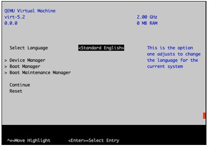
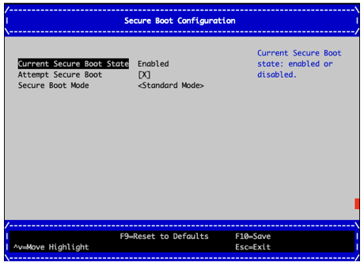
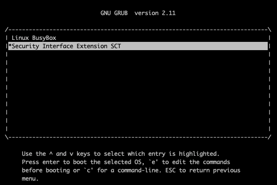
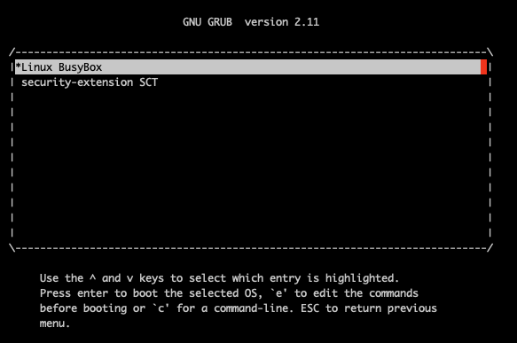

# SystemReady Security Extension User's Guide

## Introduction to the SystemReady Security Extension

The Base Boot Security Requirements (BBSR) ACS is a compliance suite that tests for compliance with the requirements specified in the Base Boot Security Requirements 1.1 specification (https://developer.arm.com/documentation/den0107/latest/).  Passing the tests in this compliance suite is required for being granted the SystemReady Security Extension certification.

The BBSR specifies requirements for the following security interfaces:
 - UEFI authenticated variables
 - UEFI secure boot
 - UEFI capsule updates
 - TPM 2.0 and measured boot

The BBSR ACS uses the same framework as the SystemReady ACS (https://github.com/ARM-software/arm-systemready), and thus follows the same model for building and running test cases.

The BBSR ACS consists of automated and manual tests.  Automated testcases include firmware based tests using the SCT (edk2-test) framework and OS-based tests using FWTS.

## Running the Security Extension ACS

### 1. Pre-requisites

The following are pre-requisites needed prior to running the ACS:

1. The security extension ACS image must be available on the system on a bootable storage device.

2. For Secure Boot the system firmware must be in "Setup Mode" where the Secure Boot keys are cleared prior to starting the ACS.  The mechanism to enroll Secure Boot keys is platform specific and the procedure to enroll the keys must be available.

3. For the update capsule test, if the system supports in-band system firmware updates, an update capsule must be available on a storage device on the system.

### 2. Enroll the Secure Boot Keys

The ACS provides a set of keys for the UEFI Secure Boot keys PK, KEK, db, and dbx.  Before starting the test suite these test keys must be enrolled using and applicable platform-specific procedure for the firmware of the platform under test.

The test keys are available on the "boot" partition of the ACS image at the following path: 
`EFI\BOOT\bbr\security-extension-acs-keys.`

The test keys are available in DER format (suitable for enrolling in EDK2) and as signed UEFI variable signature list blobs (suitable for u-boot).

DER formatted test keys:
<pre>
TestDB1.der
TestDBX1.der
TestKEK1.der
TestPK1.der
</pre>

Signed signature list formatted test keys:
<pre>
TestDB1.auth
TestDBX1.auth
TestKEK1.auth
TestPK1.auth
</pre>

#### <ul>Enrolling Keys in EDK2 - Example</ul>

For example, to enroll the Secure Boot keys on QEMU with EDK2 based firmware perform the following steps:

 - After starting the system press ESC to enter the EDK2 menu

     - 

 - Select  Device Manager -> Secure Boot Configuration

 - For Secure Boot Mode select "Custom Mode"

 - Select "Custom Secure Boot Options"

 - To enroll PK:
     - Select "PK Options"
     - Select "Enroll PK" -> "Enroll PK Using File"
     - Select the ACS disk which has the "BOOT" label
     - The secure boot keys are located at the following path on the disk:
         - EFI \ BOOT \ bbr \ security-extension-acs-keys
     - Select the following file for PK: `TestPK1.der`
     - Repeat the above steps to enroll the keys (TestKEK1.der, TestDB1.der, TestDBX1.der)  for KEK, db, dbx selecting the following options:
         - KEK Options
         - DB Options
         - DBX Option

  - After completing the above steps secure boot will be enabled

      - 

  - Reset the system

#### <ul>Enrolling Keys in U-boot</ul>

For information on enrolling keys with U-boot firmware see the following link:
https://github.com/u-boot/u-boot/blob/master/doc/develop/uefi/uefi.rst

###  3. Run SCT

The Security Extension SCT is a subset of the SCT focused on security interfaces-- authenticated variables, Secure Boot variables, Secure Boot image loading, and TCG2 protocol test for systems with TPMs.

After resetting the system with the ACS Secure Boot keys enrolled, grub will automatically start the Security Extension SCT

 - 

After the tests complete, the system returns to the UEFI Shell and the following test output is available in the acs_results partition of the ACS disk:
 - \acs_results\sct_results\Overall\Summary.log

The expected result is that all tests pass.

Note: If a TPM is present in the system and is supported by the firmware, the TCG2 protocol tests in SCT will run and will be included in the Summary.log.  If the TCG2 protocol is not present, these tests will be skipped.

###  4. Run FWTS

After completing the SCT tests, reset the system at the UEFI Shell using the **reset** command: 
`FS1:\acs_results\app_output\> reset`

After the system is reset, when the boot process reaches the Grub menu, select the "Linux BusyBox" option to boot Linux

 - 

Linux will boot and automatically run a subset of FWTS and dump the TPM event log and PCRs.

If no TPM is present the tpm2 test and dumping of PCRs and event log is skipped:
<pre>
Test Executed are uefirtauthvar tpm2
Running 2 tests, results appended to /mnt/acs_results/fwts/FWTSResults.log
Test: Authenticated variable tests.
  Create authenticated variable test.                     1 passed
  Authenticated variable test with the same authentica..  1 passed
  Authenticated variable test with another valid authe..  1 passed
  Append authenticated variable test.                     1 passed
  Update authenticated variable test.                     1 passed
  Authenticated variable test with old authenticated v..  1 passed
  Delete authenticated variable test.                     1 passed
  Authenticated variable test with invalid modified data  1 passed
  Authenticated variable test with invalid modified ti..  1 passed
  Authenticated variable test with different guid.        1 passed
  Set and delete authenticated variable created by dif..  2 passed
Test: TPM2 Trusted Platform Module 2 test.
 Test skipped.
TPM event log not found at /sys/kernel/security/tpm0/binary_bios_measurements
</pre>

If a TPM is present, the tpm2 test is run and PCRs and event log are dumped to the results partition:
<pre>
Test Executed are uefirtauthvar tpm2
Running 2 tests, results appended to /mnt/acs_results/fwts/FWTSResults.log
Test: Authenticated variable tests.
  Create authenticated variable test.                     1 passed
  Authenticated variable test with the same authentica..  1 passed
  Authenticated variable test with another valid authe..  1 passed
  Append authenticated variable test.                     1 passed
  Update authenticated variable test.                     1 passed
  Authenticated variable test with old authenticated v..  1 passed
  Delete authenticated variable test.                     1 passed
  Authenticated variable test with invalid modified data  1 passed
  Authenticated variable test with invalid modified ti..  1 passed
  Authenticated variable test with different guid.        1 passed
  Set and delete authenticated variable created by dif..  2 passed
Test: TPM2 Trusted Platform Module 2 test.
  Validate TPM2 table.                                    1 passed
TPM2: dumping PCRs and event log
  Event log: /mnt/acs_results/tmp2/eventlog.log
  PCRs: /mnt/acs_results/tmp2/pcr.log
</pre>

The expected result is that all tests pass.  The tpm2 test is only applicable to ACPI-based systems.

Logs are available in the results partition of the ACS storage device:
 - FWTS results:  /acs_results/fwts/FWTSResults.log
 - Event log: /mnt/acs_results/tmp2/eventlog.log
 - PCRs: /mnt/acs_results/tmp2/pcr.log

The event log and PCR log are evaluated as part of the measured boot test phase, see [6. TPM Measured Boot](#measured-boot)

### 5. Secure firmware update test

The BBSR requires support for update capsules compliant with the UEFI specification for systems that perform in-band firmware updates.  The Security Extension ACS firmware update test is a manual test run from the firmware that requires a valid update capsule for the system's firmware.

The UEFI specification defines two methods of performing updates with capsules:
1) UpdateCapsule() runtime function (see section 8.5.3)
2) Capsule on disk (see section 8.5.5)

Either method is acceptable for performing the capsule update test.  The vendor of the system under test must provide the update procedure to use.

Some of the steps below utilize the CapsuleApp.efi program that is located on the ACS image at the following path: EFI\BOOT\app\CapsuleApp.efi

 - ####  A. Preparation
     - Copy the vendor provided update capsule image onto a storage device.
     - Prepare a version of the vendor provided update capsule that has been "tampered" with, for use in a negative test. Using a copy of the vendor provided update capsule, use the xxd command and a text editor to modify the last byte of the image.
     - Copy the tampered-with update capsule onto the storage device.
     - Enable the storage device containing the capsule images on the system under test.

 - #### B. Reset the system.
     - Because SCT was run previously (see [Step 3](#run-sct)), the boot flow will skip running SCT and will stop at the UEFI Shell prompt:

<pre>
    Shell> echo -off
    Press any key to stop the EFI SCT running
    Load support files ... seconds
    Load proxy files ...
    Load test files ...
    Continue test preparing...
    Done!
    - [ok]
    - [ok]
    - [ok]
    Running CapsuleApp
    FS1:\acs_results\app_output\>
</pre>

 - #### C. Dump the firmware's EFI System Resource Table (ESRT) using the command: `CapsuleApp -E`
     - Expected Result: the ESRT dump shows a table entry for all updateable system firmware components
     - See example below:
<pre>
    FS0:\EFI\BOOT\app\CapsuleApp.efi -E

    ##############
    # ESRT TABLE #
    ##############
    EFI_SYSTEM_RESOURCE_TABLE:
    FwResourceCount    - 0x1
    FwResourceCountMax - 0x40
    FwResourceVersion  - 0x1
    EFI_SYSTEM_RESOURCE_ENTRY (0):
      FwClass                  - 50B94CE5-8B63-4849-8AF4-EA479356F0E3
      FwType                   - 0x1 (SystemFirmware)
      FwVersion                - 0x26
      LowestSupportedFwVersion - 0x1
      CapsuleFlags             - 0x1
      LastAttemptVersion       - 0x26
      LastAttemptStatus        - 0x0 (Success)
</pre>

 - ####  D. Dump the FMP information advertised by the firmware using the command: `CapsuleApp -P`
     - Expected Result:
         - The ImageTypeId fields match the FwClass advertised by the ESRT
         - The AUTHENTICATION_REQUIRED attribute is set indicating that image authentication is required
     - See example below:
<pre>
    FS0:\EFI\BOOT\app\CapsuleApp.efi -P

    ############
    # FMP DATA #
    ############
    FMP (0) ImageInfo:
      DescriptorVersion  - 0x3
      DescriptorCount    - 0x1
      DescriptorSize     - 0x70
      PackageVersion     - 0xFFFFFFFF
      PackageVersionName - "Unknown"
      ImageDescriptor (0)
        ImageIndex                  - 0x1
        ImageTypeId                 - 50B94CE5-8B63-4849-8AF4-EA479356F0E3
        ImageId                     - 0x584F425645444E53
        ImageIdName                 - "Socionext Developer Box"
        Version                     - 0x26
        VersionName                 - "build #38U"
        Size                        - 0x280000
        AttributesSupported         - 0xF
          IMAGE_UPDATABLE           - 0x1
          RESET_REQUIRED            - 0x2
          AUTHENTICATION_REQUIRED   - 0x4
          IN_USE                    - 0x8
          UEFI_IMAGE                - 0x0
        AttributesSetting           - 0xF
          IMAGE_UPDATABLE           - 0x1
          RESET_REQUIRED            - 0x2
          AUTHENTICATION_REQUIRED   - 0x4
          IN_USE                    - 0x8
          UEFI_IMAGE                - 0x0
        Compatibilities             - 0x0
          COMPATIB_CHECK_SUPPORTED  - 0x0
        LowestSupportedImageVersion - 0x1
        LastAttemptVersion          - 0x26
        LastAttemptStatus           - 0x0 (Success)
        HardwareInstance            - 0x0
    FMP (0) PackageInfo - Unsupported

</pre>

 - #### E. Dump the update capsule header using the command: `CapsuleApp -D [capsule-image]`
     - Expected Result: The dump shows a valid CapsuleHeader, FmpHeader, and FmpPayload
     - See example below:
<pre>
    FS0:\EFI\BOOT\app\CapsuleApp.efi -D DeveloperBox.Cap

    [FmpCapsule]
    CapsuleHeader:
      CapsuleGuid      - 6DCBD5ED-E82D-4C44-BDA1-7194199AD92A
      HeaderSize       - 0x20
      Flags            - 0x0
      CapsuleImageSize - 0x2DC035
    FmpHeader:
      Version             - 0x1
      EmbeddedDriverCount - 0x0
      PayloadItemCount    - 0x1
      Offset[0]           - 0x10
    FmpPayload[0] ImageHeader:
      Version                - 0x2
      UpdateImageTypeId      - 50B94CE5-8B63-4849-8AF4-EA479356F0E3
      UpdateImageIndex       - 0x1
      UpdateImageSize        - 0x2DBFDD
      UpdateVendorCodeSize   - 0x0
      UpdateHardwareInstance - 0x0
</pre>

 - #### F. Test an firmware update using the CapsuleApp with the "tampered" capsule image

     - This is a negative test that verifies whether the firmware update process will correct validate and reject a capsule that has been tampered with. The expected result is that the firmware update must not be processed.

     - To perform this test, follow the vendor provided procedure to perform the update using a capsule that has been tampered with (see the [Preparation](#fwup-prep) step above).

     - Below is an example using the CapsuleApp:

<pre>
    FS1:> FS0:\EFI\BOOT\app\CapsuleApp.efi FS2:\DeveloperBox.tampered.cap
    CapsuleApp: creating capsule descriptors at 0xFF7BC898
    CapsuleApp: capsule data starts          at 0xF491F018 with size 0x2DC035
    CapsuleApp: block/size                   0xF491F018/0x2DC035
    FS1:> 
</pre>

 - #### G. Test an firmware update using the CapsuleApp with the vendor provided capsule

     - To perform this test follow the vendor provided procedure to perform the update using the valid vendor provided update capsule.  The expected result is that the capsule is processed successfully and the firmware is updated.

     - Reset the system

     - Repeat the test step to [dump the FMP](#dumpfmp) to verify that the FMP advertises the new firmware version.

     - Below is an example of performing an update using the CapsuleApp:

<pre>
    FS1:> FS0:\EFI\BOOT\app\CapsuleApp.efi FS2:\DeveloperBox.cap
    CapsuleApp: creating capsule descriptors at 0xFF7BC018
    CapsuleApp: capsule data starts          at 0xF491F018 with size 0x2DC035
    CapsuleApp: block/size                   0xF491F018/0x2DC035
    Updating firmware - please wait....................................
    FS1:> 
</pre>

###  6. TPM Measured Boot

Measured boot enables detection of tampering of firmware, configuration data, and software components by measuring (i.e. computing a hash) of security relevant firmware components and data during boot and securely extending the hash into a PCR in a TPM device.  The PCR values can be used at a later point in time to enforce security policies.

The BBSR specification describes the requirements for TPM-based measured boot, primarily by reference to the TCG PC Client Platform Firmware Profile Specification.

Verifying compliance of measured boot is a manual procedure that involves examining the TPM event log and PCR register dumps produced during the FWTS test phase.  See [4. Run FWTS](#run-fwts)

The two logs are available in the results partition of the ACS storage device:
 - Event log: /mnt/acs_results/tmp2/eventlog.log
 - PCRs: /mnt/acs_results/tmp2/pcr.log

The steps below explain how to verify some key requirements defined in the TCG Firmware Profile specification.  The measurements for a given system are highly platform-specific, and the TCG Firmware Profile specification will dictate the specific requirements.

#### Step 1 - Verify the cumulative SHA256 measurements from the event log matches the TPM PCRs 0-7

The events logged in the TPM event log must match the actual measurements extended in the TPM PCRs.  It is trivial to do a visual comparison by looking at the SHA256 measurements in the pcr.log file and the computed values at the end of eventlog.log.

See the example below where the PCR values and event log values match.

Example:
SHA256 values for PCRs 0-7 from pcr.log
<pre>
sha256:
  0 : 0x4A17B720C5E37DCD65533EB47CDE5B5E1E93E9A5953B42E913F2C83D88576685
  1 : 0x8EFBC5102BEB859074EC99DB20009BD213726B57777DA560B7BC7AA567C22425
  2 : 0x3D458CFE55CC03EA1F443F1562BEEC8DF51C75E14A9FCF9A7234A13F198E7969
  3 : 0x3D458CFE55CC03EA1F443F1562BEEC8DF51C75E14A9FCF9A7234A13F198E7969
  4 : 0xFE3C30CA8D4CACCAAAE635D60DC3132D1B5C93E0F2BB092BF0D83287D76B1210
  5 : 0x768A45048228ECE6EF442FA88AF60DFB19D8ABCB1869E1DBDBEAEA1244353037
  6 : 0x3D458CFE55CC03EA1F443F1562BEEC8DF51C75E14A9FCF9A7234A13F198E7969
  7 : 0x7D852DB48CA55F36243903877E416D4AF77AA8755010C064884799E70F51664D
</pre>

SHA256 values for PCRs 0-7 from eventlog.log
<pre>
pcrs:
  sha256:
    0  : 0x4a17b720c5e37dcd65533eb47cde5b5e1e93e9a5953b42e913f2c83d88576685
    1  : 0x8efbc5102beb859074ec99db20009bd213726b57777da560b7bc7aa567c22425
    2  : 0x3d458cfe55cc03ea1f443f1562beec8df51c75e14a9fcf9a7234a13f198e7969
    3  : 0x3d458cfe55cc03ea1f443f1562beec8df51c75e14a9fcf9a7234a13f198e7969
    4  : 0xfe3c30ca8d4caccaaae635d60dc3132d1b5c93e0f2bb092bf0d83287d76b1210
    5  : 0x768a45048228ece6ef442fa88af60dfb19d8abcb1869e1dbdbeaea1244353037
    6  : 0x3d458cfe55cc03ea1f443f1562beec8df51c75e14a9fcf9a7234a13f198e7969
    7  : 0x7d852db48ca55f36243903877e416d4af77aa8755010c064884799e70f51664d
</pre>

#### Step 2 - Verify the EV_NO_ACTION event for Specification ID version

The first event in the event log must be the Specification ID version.  This is an EV_NO_ACTION event and is not extended into a PCR.

See example:
<pre>
- EventNum: 0
  PCRIndex: 0
  EventType: EV_NO_ACTION
  Digest: "0000000000000000000000000000000000000000"
  EventSize: 45
  SpecID:
  - Signature: Spec ID Event03
    platformClass: 0
    specVersionMinor: 0
    specVersionMajor: 2
    specErrata: 0
    uintnSize: 2
    numberOfAlgorithms: 4
</pre>

#### Step 3 - Verify EV_POST_CODE events for measurements of firmware to PCR[0]

All mutable, Secure world firmware components must be measured into PCR[0] using the EV_POST_CODE event type.  The suggested event data values are provided in BBSR.

#### Step 4 - Verify EV_POST_CODE events for measurements of signed data PCR[0]

All signed critical data must be measured into PCR[0] using the EV_POST_CODE event type, with platform-specific event data.

#### Step 5 - Verify Secure Boot policy measurements

The contents of the SecureBoot, PK, KEK, db, and dbx variables must be measured into PCR[7] using the EV_EFI_VARIABLE_DRIVER_CONFIG event type.

See example below for the measurement of the SecureBoot variable:

<pre>
- EventNum: 3
  PCRIndex: 7
  EventType: EV_EFI_VARIABLE_DRIVER_CONFIG
  DigestCount: 4
  Digests:
  - AlgorithmId: sha1
    Digest: "d4fdd1f14d4041494deb8fc990c45343d2277d08"
  - AlgorithmId: sha256
    Digest: "ccfc4bb32888a345bc8aeadaba552b627d99348c767681ab3141f5b01e40a40e"
  - AlgorithmId: sha384
    Digest: "2cded0c6f453d4c6f59c5e14ec61abc6b018314540a2367cba326a52aa2b315ccc08ce68a816ce09c6ef2ac7e514ae1f"
  - AlgorithmId: sha512
    Digest: "94a377e9002be6e1d8399bf7674d9eb4e931df34f48709fddd5e1493bfb96c19ee695387109a5a5b42f4871cbee8e32a9f3282636e99a8890762ee45bd7b34b7"
  EventSize: 53
  Event:
    VariableName: 61dfe48b-ca93-d211-aa0d-00e098032b8c
    UnicodeNameLength: 10
    VariableDataLength: 1
    UnicodeName: SecureBoot
    VariableData: "01"
</pre>

#### Step 6 - UEFI BootOrder and Boot#### variables

If the UEFI BootOrder and Boot#### variables are used by the firmware, they must be measured into PCR[1] with event types EV_EFI_VARIABLE_BOOT or EV_EFI_VARIABLE_BOOT2.

#### Step 7 - Verify boot attempt measurements

Platform firmware must record each boot attempt into PCR[4] using the event type EV_ACTION with the action string “Calling EFI Application from Boot Option”.

#### Step 8 - Verify PCR[1] measurements

Measurements of security relevant configuration data go into PCR[1].

This should include configuration data such as the security lifecycle state of a system.

Security relevant SMBIOS structures must be measured into PCR[1] using event type EV_EFI_HANDOFF_TABLES.  This should include structures that identify the platform hardware (manufacturer, model number, version, etc).

#### Step 9 - Verify EV_SEPARATOR measurements

The EV_SEPARATOR event delineates the point in platform boot where the platform firmware relinquishes control of making measurements into the TPM. There must be an EV_SEPARATOR measurement for each PCR[0] through PCR[7].

## License
System Ready ACS is distributed under Apache v2.0 License.

## Feedback, contributions, and support

 - For feedback, use the GitHub Issue Tracker that is associated with this repository.
 - For support, please send an email to "support-systemready-acs@arm.com" with details.
 - Arm licensees can contact Arm directly through their partner managers.
 - Arm welcomes code contributions through GitHub pull requests.

--------------

*Copyright (c) 2021, Arm Limited and Contributors. All rights reserved.*
